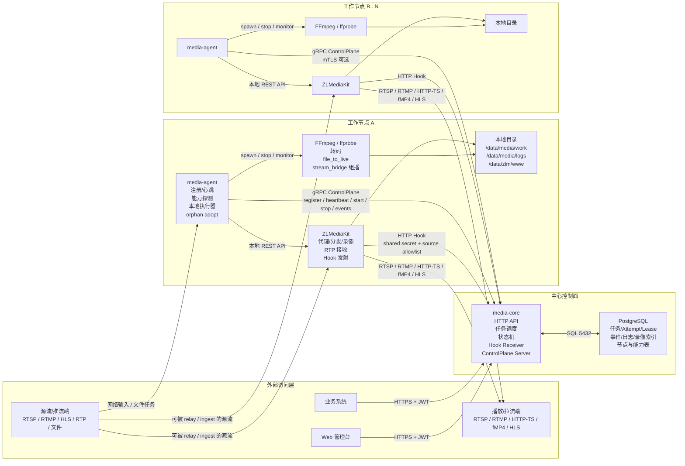
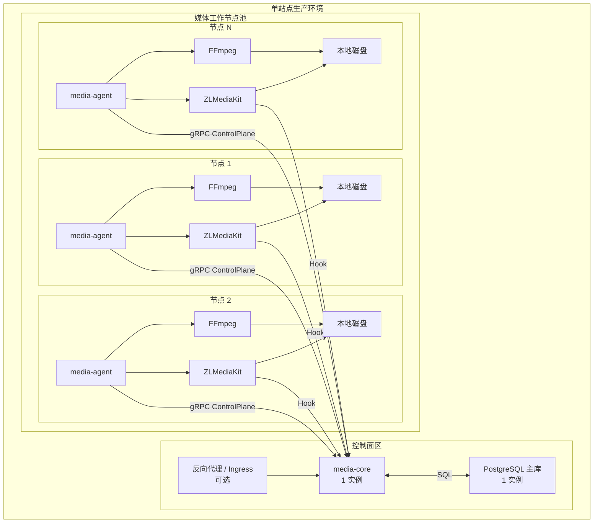
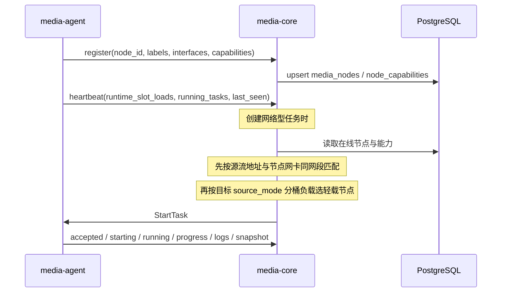
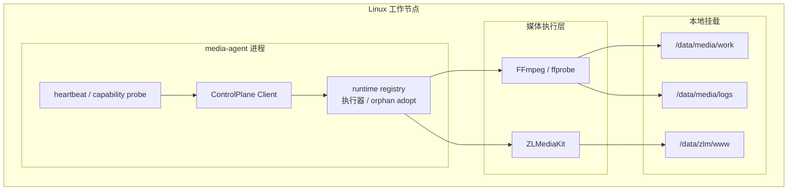
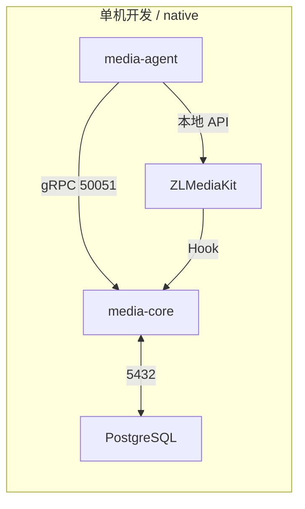
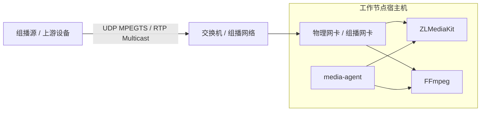
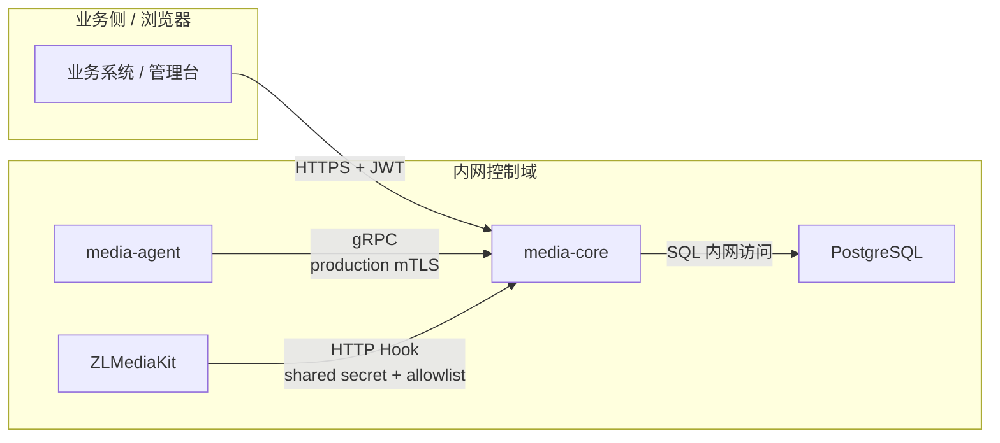

# 17. 部署架构图

## 1. 文档目标

本文件给出 StreamServer 当前版本的详细部署架构图，覆盖：

- 系统总览拓扑
- 单站点生产部署
- 工作节点内部结构
- 本地开发与 native 拓扑
- 组播网络拓扑
- 证书、密钥与信任边界

本文件偏“落地部署视角”。系统边界与文字说明可参考 [架构与部署拓扑](./01-architecture.md)，环境基线可参考 [环境准备与依赖基线](./16-environment-and-dependencies.md)。

## 2. 总体架构图

## 3. 单站点生产部署图

当前推荐的是“单 `media-core` + 单 PostgreSQL + 多工作节点”。

部署含义：

- 控制面默认只需要一个 `media-core`。
- 真正的媒体负载、转码负载、录像负载都在工作节点。
- 工作节点之间不互相发现，也不直接互相调度。
- 每个工作节点只主动连接中心 `media-core`。

## 4. 调度与节点发现图

规则摘要：

- 节点唯一身份只由 `node_id` 决定。
- 节点不互相发现，只由 `media-core` 统一维护在线状态。
- 源流地址同网段优先只是调度加分项，不是强约束。
- 若没有任何节点与源流地址同网段，仍回落到其他在线节点。

## 5. 工作节点内部结构图

职责拆分：

- `media-agent` 负责任务语义、生命周期、回传事件、恢复与接管。
- ZLM 负责实时代理、分发、RTP 接收、Hook、录像。
- FFmpeg 负责真正的文件转码、文件推流、组播桥接等重处理任务。

## 6. 本地开发与 native 拓扑图

说明：

- 普通 HTTP/RTSP/RTMP 联调直接使用宿主机端口。
- 需要真实组播验证时，`media-agent` 与 `ZLMediaKit` 直接绑定宿主机网卡。
- 本地服务互访优先走明确的本机或内网地址，不依赖服务名解析。

## 7. 组播网络拓扑图

### 7.1 推荐的宿主机网卡拓扑

### 7.2 组播相关约束

- 直接使用宿主机网卡加入和发送组播。
- 若要隔离网络，优先使用独立物理网卡、VLAN 或主机路由策略。
- 不建议通过会丢弃广播或组播的虚拟网络承载组播。
- `localaddr` 必须是节点真实存在的网卡地址。
- 交换机、宿主机防火墙、路由、IGMP 配置都要提前验证。

## 8. 证书、密钥与信任边界图

当前实现口径：

- 外部业务访问只打到 `media-core`。
- `media-core <-> media-agent` 在 production 必须使用 mTLS；仅 development + loopback + `--insecure-dev` 可使用明文。
- `media-core <-> ZLM` 通过 Hook shared secret 和源地址白名单约束。
- PostgreSQL 不对业务侧开放。

证书与密钥准备规则：

- production 的 Agent 必须连接 `https://` gRPC endpoint，并手工准备：
  - Core 服务端证书
  - Core 服务端私钥
  - 客户端 CA
  - Agent 客户端证书
  - Agent 客户端私钥
  - Agent 使用的 CA

## 9. 端口与流量矩阵

| 通道 | 发起方 | 目标 | 默认端口 | 说明 |
| --- | --- | --- | --- | --- |
| 北向 HTTP API | 业务系统 / 管理台 | `media-core` | `8080` | 开发默认 |
| 北向 HTTPS API | 业务系统 / 管理台 | `media-core` | `8443` | production 非 loopback 监听必需 |
| ControlPlane gRPC | `media-agent` | `media-core` | `50051` | 注册、心跳、任务下发 |
| PostgreSQL | `media-core` | `postgres` | `5432` | 状态与审计真相库 |
| ZLM API | `media-agent` | 节点本地 ZLM | 由配置决定 | 本地节点内调用 |
| ZLM Hook | 节点本地 ZLM | `media-core` | 复用 HTTP API | 回调 |
| RTSP 播放 | 播放端 | 节点 ZLM | `554` 等 | 由 ZLM 决定 |
| RTMP 播放/推流 | 推流端 / 播放端 | 节点 ZLM | `1935` 等 | 由 ZLM 决定 |
| HTTP-TS/HLS/fMP4 | 浏览器 / 播放端 | 节点 ZLM | `80/443/自定义` | 由 ZLM 决定 |
| RTP 接收 | 外部发送端 | 节点 ZLM | 动态端口 | `rtp_receive` 打开 |
| 组播输入/输出 | 节点网卡 | 外部组播网络 | 动态 UDP | `stream_bridge` 组播模式使用 |

## 10. 部署建议

### 10.1 最小生产形态

- `media-core` 1 实例
- PostgreSQL 1 实例
- 至少 1 个工作节点
- 节点内包含 `media-agent + ZLMediaKit + FFmpeg`

### 10.2 推荐的首版上线路径

1. 可在 development 的 loopback 地址上用 `media-core --insecure-dev` 做本机验证。
2. 切换 production 前准备 Core HTTP TLS（若需非 loopback）和完整 gRPC mTLS 证书链，并完成管理员迁移。
3. 再根据是否需要组播，决定节点网络模式使用 `bridge`、`host` 还是 `macvlan`。

### 10.3 不建议的形态

- 首版做 `media-core` 多活。
- 让业务方直接调用 ZLM API。
- 把 PostgreSQL 暴露给业务侧。
- 让工作节点之间互相调度或互相发现。

## 11. 总结

当前项目的部署模型可以概括为：

- 一个中心控制面：`media-core + PostgreSQL`
- 多个执行节点：`media-agent + ZLMediaKit + FFmpeg`
- 业务只访问中心控制面
- 媒体流量落在工作节点
- 节点统一向中心注册，由中心调度

这套拓扑对当前实现是最贴合、最稳妥、也最容易运维收口的部署方式。
